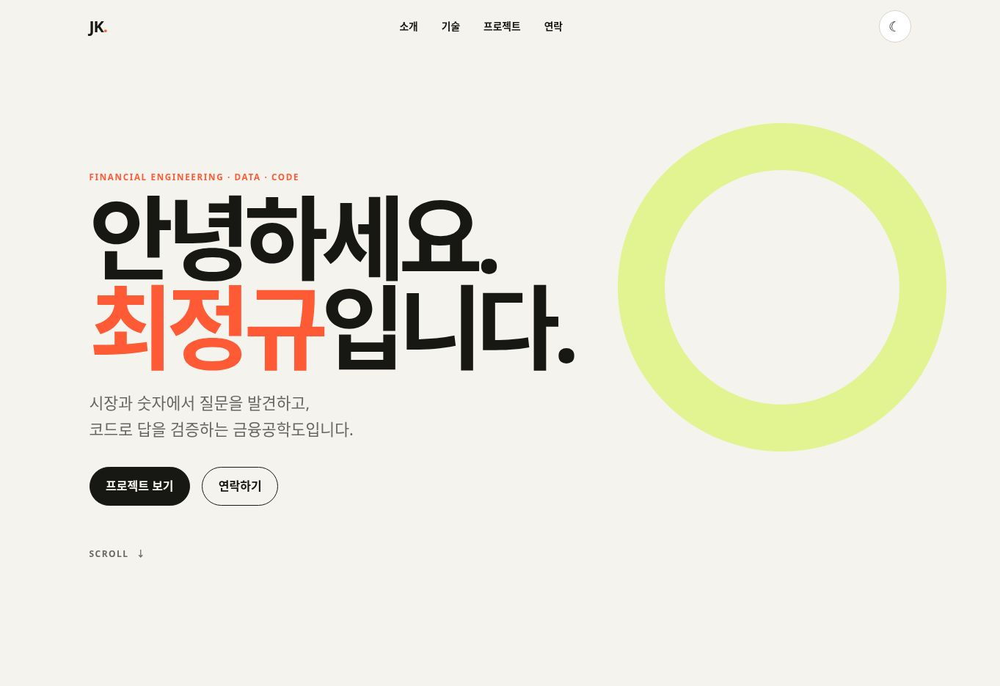
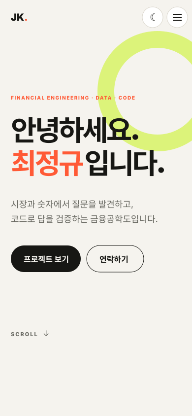
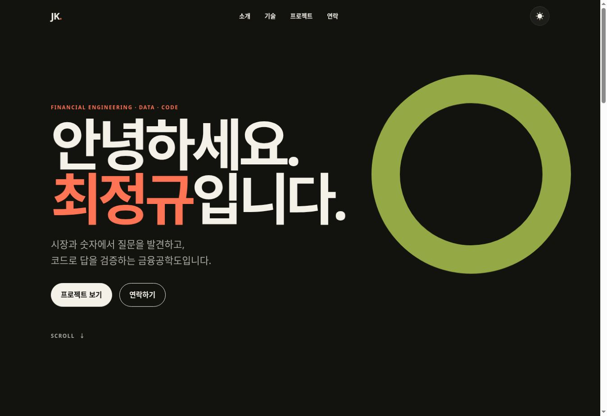

# 최정규 포트폴리오

순수 HTML, CSS, JavaScript로 만든 반응형 자기소개 웹페이지입니다. 금융공학을 공부하는 과정과 기술 관심사를 소개하고, GitHub API에서 `choijk136` 계정의 저장소를 가져와 프로젝트 카드로 표시합니다.

## 배포 URL

- GitHub Pages: <https://choijk136.github.io/B1-1_webpage/>
- GitHub 저장소: <https://github.com/choijk136/B1-1_webpage>

> 첫 배포는 GitHub Actions 완료까지 1~3분 정도 걸릴 수 있습니다.

## 주요 기능

- 모바일·태블릿·데스크톱 반응형 레이아웃
- 시맨틱 태그를 사용한 Hero, About, Skills, Projects, Contact, Footer 구조
- 모바일 햄버거 메뉴와 앵커 부드러운 스크롤
- 다크 모드 전환 및 `localStorage` 저장
- 스크롤 위치에 따른 헤더·맨 위로 버튼 상태 변경
- Intersection Observer 기반 등장 애니메이션
- Contact 폼 필수값·이메일 형식 검사와 필드별 오류 표시
- `fetch`와 `async/await`를 사용한 GitHub API 연동
- 프로젝트 로딩·성공·오류·빈 상태별 UI 렌더링과 오류 시 재시도

## 사용 기술

- HTML5: 시맨틱 마크업, 접근성 속성, 폼 구조
- CSS3: CSS 변수, Flexbox, Grid, transition, 모바일 퍼스트 미디어 쿼리
- JavaScript ES6+: DOM API, 이벤트, 화살표 함수, 구조분해 할당, 템플릿 리터럴, `map`·`forEach`, `fetch`, `async/await`, `try/catch`
- GitHub REST API: `GET /users/choijk136/repos`
- GitHub Actions & Pages: 정적 사이트 자동 배포

## 이벤트 → 상태 → 렌더링 흐름

1. 테마 버튼 클릭 → `state.theme` 변경 및 로컬스토리지 저장 → `data-theme`과 아이콘 갱신
2. GitHub API 호출 → `state.projectStatus`가 loading/success/error/empty로 변경 → Projects 상태 UI 갱신
3. 폼 `input`·`submit` 이벤트 → `state.formErrors` 변경 → 필드 오류 또는 성공 메시지 갱신
4. 햄버거 버튼 클릭 → 메뉴의 활성 상태 변경 → 메뉴·버튼 클래스와 접근성 속성 갱신

## 구현 기준값

| 기능 | 기준값 |
| --- | --- |
| 태블릿 브레이크포인트 | 768px |
| 데스크톱 브레이크포인트 | 1024px |
| 헤더 배경 변경 | 세로 스크롤 60px 이상 |
| 맨 위로 버튼 표시 | 세로 스크롤 300px 이상 |
| 등장 애니메이션 | Intersection Observer `threshold: 0.2` |

## 프로젝트 구조

```text
.
├── index.html
├── css/
│   └── style.css
├── js/
│   └── main.js
├── images/
│   ├── profile.svg
│   └── screenshots/
│       ├── desktop.jpg
│       ├── mobile.svg
│       └── dark-mode.jpg
└── .github/workflows/
    └── deploy-pages.yml
```

## 로컬 실행

1. 저장소를 clone한 뒤 VS Code로 폴더를 엽니다.
2. VS Code의 **Live Server** 확장을 설치합니다.
3. `index.html`을 우클릭하고 **Open with Live Server**를 선택합니다.

GitHub API는 인증 없이 시간당 60회로 제한됩니다. 짧은 시간에 반복 새로고침하면 403 응답이 발생할 수 있으며, 이 경우 화면에 오류 메시지와 다시 시도 버튼이 표시됩니다.

## 화면 미리보기

### 데스크톱



### 모바일



### 다크 모드



## 설계 설명

페이지의 큰 영역은 목적을 드러내도록 `header`, `nav`, `main`, `section`, `article`, `footer`로 구분했습니다. 한 방향 정렬이 중요한 네비게이션과 버튼 그룹은 Flexbox를 사용했고, 화면 너비에 따라 카드 열 개수가 달라지는 Projects 영역은 `repeat(auto-fit, minmax(...))` Grid를 사용했습니다.

프로젝트 데이터는 요청 전에 loading 상태로 바꾸고, 응답 결과에 따라 success 또는 empty 상태를 선택합니다. 네트워크 오류나 API 레이트 리밋은 `catch`에서 error 상태로 전환합니다. 각 상태 변경 후 같은 렌더 함수가 DOM을 갱신하므로 데이터 흐름을 한곳에서 확인할 수 있습니다.
